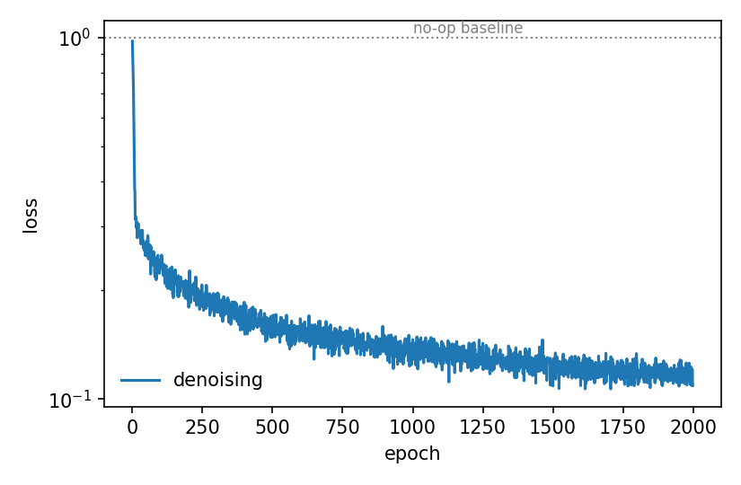
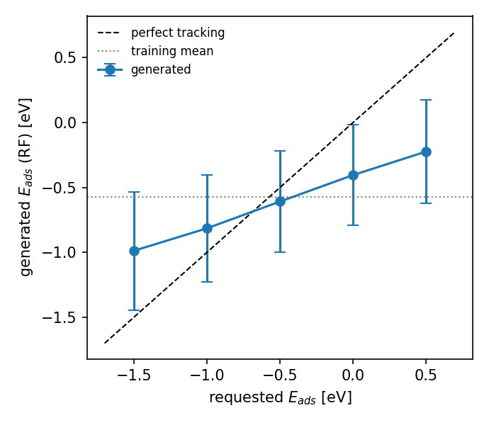

# Diffusion-based inverse design of bimetallic N<sub>2</sub>-activation catalysts

Ask a generative model for *"an alloy whose nitrogen adsorption energy is 0 eV"* and get back ranked,
physically valid candidates — with an honest account of how far that can be trusted.

End-to-end pipeline: DFT database → forward property model → guided diffusion → decoded alloy
candidates → screening. Repaired and productionised from the supporting information of
**ja5c14652**, which does not run as published: ten defects are documented below, three of them
silent scientific failures rather than crashes.

**No GPU required.** A complete run takes **209 s on CPU** (16-core laptop, TensorFlow-CPU 2.15.1).

---

## Results

One run, seed 71, target 0.0 eV. Every number on this page comes from that run —
[`outputs/run_report.json`](outputs/run_report.json) and
[`outputs/analysis_report.json`](outputs/analysis_report.json), both regenerable by the two
commands in [Quick start](#quick-start).

| | |
|---|---|
| RF judge (validation, 220 sites) | MAE **0.215 eV**, R² 0.795 |
| MLP surrogate (validation) | MAE **0.205 eV**, R² 0.838 |
| Diffusion training | 2000 epochs = 14 000 gradient steps in **99.7 s** |
| Final denoising loss | **0.109** (1.0 = predicting no noise at all) |
| Generated | 200 candidates → **111 distinct alloys**, 28 within 0.15 eV of target |
| Survive both trust filters | **66 / 200** (50 distinct alloys) |
| **Total wall time** | **209.2 s** |

<p align="center">
  
  
</p>

**Convergence check** — the diagnostic that matters for a generative model. Falling loss proves
nothing; *unguided* samples must reproduce the training spread, which is std = 1.00 by construction
in standardized space:

| | real | generated |
|---|---|---|
| std | 0.998 | 0.943 |
| per-dim std | 0.997 | 0.930 |
| range | [−3.08, 5.06] | [−3.20, 6.18] |

Under the published `EPOCHS = 50` the same check returns std **1.95** over **[−9.5, 11.7]** — a
diverged reverse process, and the single fastest way to catch it.

**Target tracking** (requested → generated, scored by the held-back forest):

| requested | −1.5 | −1.0 | −0.5 | 0.0 | +0.5 |
|---|---|---|---|---|---|
| generated | −0.99 | −0.82 | −0.61 | −0.41 | −0.22 |

Monotonic, but **shrunk toward the training mean** (−0.575 eV): a 2.0 eV swing in the request moves
the output 0.78 eV, so guidance recovers ~39 % of what is asked for. That is reported, not tuned
away — see [Honest limits](#honest-limits) for why raising the guidance scale does not fix it.

---

## Setup

The DFT database (`JY_data_dfilling_nonsite.xlsx`) and the pre-trained forest (`Nads_opt.pkl`) are
supporting information of ja5c14652 and are **not redistributed here.** Download
`ja5c14652_si_001.zip` from the publisher, unzip it, and point the pipeline at the resulting
`DD_model_code` folder:

```bash
export N2DD_DATA_DIR=/path/to/DD_model_code
```

On Windows PowerShell:

```powershell
$env:N2DD_DATA_DIR = "C:\path\to\DD_model_code"
```

Alternatively, copy the two files into `data/`. Then:

```bash
pip install -r requirements.txt
```

Verified on Python 3.9 (conda env **CompChem**), TensorFlow-CPU 2.15.1, scikit-learn 1.6.1.
`Nads_opt.pkl` was pickled under scikit-learn 1.5.2, so loading it emits
`InconsistentVersionWarning`; its predictions are unaffected (val MAE 0.2154 eV reproduces exactly
across versions).

## Quick start

```bash
python run_pipeline.py
```

```bash
python analyze_model.py
```

The first trains and generates; the second regenerates the measured numbers behind
[`MODEL_ANALYSIS.md`](MODEL_ANALYSIS.md). Other modes:

```bash
python run_pipeline.py --quick
```

```bash
python run_pipeline.py --target -0.5 --n-samples 500
```

```bash
python run_pipeline.py --skip-train --target 0.5
```

---

## What it does

| Stage | Module | Role |
|---|---|---|
| 1 | [`n2dd/data.py`](n2dd/data.py) | Loads 28 mono + 1368 bimetallic DFT sites; applies the `N_ads ∈ (−2, 1)` window (→ 20 + 1098); reproduces `Pred_Model_train.py`'s split exactly so the pre-trained scaler is recovered |
| 2 | [`n2dd/forward.py`](n2dd/forward.py) | RF **judge** (`Nads_opt.pkl`) + differentiable MLP **guide** — deliberately two models |
| 3 | [`n2dd/diffusion.py`](n2dd/diffusion.py) | DDPM over the 30-dim standardized vector, with classifier guidance at sampling time |
| 4 | [`n2dd/decode.py`](n2dd/decode.py) | Projects raw samples back onto physically valid alloys |
| 5 | [`n2dd/screen.py`](n2dd/screen.py) | Scores with the held-back forest, ranks, flags low-confidence candidates |

`run_pipeline.py` chains all five. `MODEL_ANALYSIS.md` is the design analysis.
`N2_catalyst_diffusion.ipynb` is the annotated walkthrough — it derives every step from scratch and
ships with stored outputs, so it reads on GitHub without being run. Those outputs come from its own
separate execution; the canonical numbers are the JSON reports in `outputs/`.

**Why two forward models.** A scikit-learn forest is piecewise-constant and is not a TensorFlow op,
so `tape.gradient` returns `None` through it — it cannot supply a guidance gradient at all. The MLP
surrogate exists to provide ∂E/∂x; the forest is kept strictly out of the loop and used only to
score what was generated. The model doing the steering is never the model doing the judging, and
their disagreement `|RF − surrogate|` becomes a usable confidence flag.

**Method.** DDPM with a linear β schedule (1e-4 → 0.02, T = 1000), ε-prediction objective, and a
denoiser of sinusoidal t-embedding (128) → 2×Dense(128) concatenated with x → Dense(128) → 256 →
256 → 30, swish throughout. Targeting is *sampling-time classifier guidance*,

$$\hat\varepsilon \leftarrow \varepsilon_\theta(x_t,t) + s\,\sqrt{1-\bar\alpha_t}\,\nabla_x\big(f_\phi(x)-E^*\big)^2$$

with `s = 10` and the gradient norm-clipped to 20 per sample. The $\sqrt{1-\bar\alpha_t}$ factor
keeps guidance commensurate with the noise level at each step. One consequence, stated plainly: the
trained checkpoint is an **unconditional** prior, so one model serves any target — but this should
not be called a conditional diffusion model.

---

## Defects found in the published SI code

The pipeline could not run as shipped. Ten fixes, in rough order of how much they mattered:

**Silent scientific failures (found only by running it):**

1. **`EPOCHS = 50` is 350 gradient steps.** 878 rows at batch 128 = 7 steps/epoch. The denoising
   loss never leaves ~0.31 and the reverse process diverges — samples emerge with std 1.95 over
   [−9.5, 11.7] where real standardized data has std 1.00 over [−3.1, 5.1]. → 2000 epochs, lr 5e-4.
2. **The RF guidance term carries no gradient.** scikit-learn is not a TF op, so `tape.gradient`
   returns `None` and `lambda_cond * loss_condition` is *inert* — the published "inverse design"
   optimises nothing. → differentiable MLP surrogate guides; the forest judges independently.
3. **`lambda_cond = 10.0` on an unclipped x̂₀ destroys the generator.** At large *t*,
   x̂₀ = (xₜ − √(1−ᾱ)·ε)/√ᾱ divides by √ᾱ → 0, so the property term dominates. Run as published
   (with the syntax bugs fixed) it drives samples to ~10⁴ and collapses all 200 onto **one** alloy.
   → x̂₀ clipped, term weighted by ᾱₜ, targeting moved to sampling-time guidance.

**Errors that stop execution:**

4. `VECTOR_SIZE = 18`, but the data has **30** features and `Nads_opt.pkl` reports
   `n_features_in_ = 30`.
5. `schedule['alpha'][t]` — `schedule` is an object, not a dict, and has no such attribute.
6. `pickle.load` of a 77 MB forest **inside** `@tf.function`, re-read every batch.
7. `reverse_gen.py` uses undefined globals `alphas` / `betas`.
8. `Pred_Model_train.py` reads a filename not in the zip and imports two missing modules.

**Correctness gaps:**

9. No feature scaling in the diffusion loop, though `Nads_opt.pkl` expects standardized inputs.
10. No decoder — raw 30-float samples are printed as if they were materials.

---

## Honest limits

Three measured facts that bound what this pipeline can claim. All three are quantified in
[`MODEL_ANALYSIS.md`](MODEL_ANALYSIS.md).

**Guidance saturates, and the reason is structural.** Raising the scale 10× buys almost nothing:

| guidance scale | 0 | 10 | 100 |
|---|---|---|---|
| mean E_ads (RF) | −0.606 | −0.370 | −0.314 |
| sample std | 0.943 | 0.918 | 0.932 |
| distinct alloys | 127 | 111 | 114 |

Sample quality and diversity are *unharmed* at s = 100, so this is not the usual
targeting-vs-quality trade-off. The real limiter: guidance moves all 30 dimensions, but the decoder
overwrites **26** of them — composition is argmax-ed to an element pair, the 10 elemental
descriptors are replaced with tabulated values. Only the pair choice and 4 d-band fillings survive
to scoring.

**A row is a site, not a material.** The 1098 filtered rows are only 308 distinct compositions
(3.56 adsorption sites each). Within a single fixed composition, `N_ads` spreads by 0.525 eV on
average — and the within-material σ of **0.262 eV exceeds the RF's own validation MAE of 0.215 eV**.
Nothing in the pipeline aggregates sites into materials, so "28 of 200 within 0.15 eV" counts
favourable **sites**, not favourable **materials**.

**The steering range sits inside the noise floor.** Guidance moves the mean by ~0.3 eV; both models
doing the steering and the scoring have MAE ≈ 0.21 eV. Any claim of hitting a target to better than
~0.2 eV is not supported by these models.

Everything generated is a **hypothesis for DFT**, not a validated catalyst.

---

## Interpreting the output

[`outputs/generated_candidates.csv`](outputs/generated_candidates.csv) is ranked by
`abs_err_target`. Do **not** read it top-down. Filter on two columns first:

- **`model_spread`** = |RF − surrogate| (this run: median 0.19, p90 0.49 eV). Large values mean the
  two property models disagree, so the candidate is unreliable however good its predicted energy
  looks. Note both were fitted on the same 1098 sites, so this is a weak uncertainty estimate.
- **`fill_dist_to_nearest_real`** — the decoder treats `filling_a..d` as free coordinates, but in
  reality those are local d-band fillings that follow from a converged DFT DOS calculation. A
  candidate is only believable if its filling block sits close to a real computed site.

[`outputs/top_candidates.csv`](outputs/top_candidates.csv) applies both filters
(`screen.trustworthy`); 66 of 200 candidates pass. The leaders this run are Os–Au 50:50, Pt₃Ir,
Ni₃Ir and Co–Au 50:50, all with |RF − surrogate| < 0.1 eV.

---

## Reproducibility

- Every hyperparameter lives in one `Config` dataclass and is written to
  [`outputs/config_used.json`](outputs/config_used.json) on each run.
- Both networks are checkpointed — the denoiser *and* the guidance surrogate. This matters:
  `--skip-train` restores the diffusion prior, and a re-trained surrogate would hand it a different
  guidance gradient, so the same seed would silently produce a different candidate set. With both
  restored, `--skip-train` reproduces the candidate CSV byte-for-byte.
- The 80/20 split and scaler are pinned to `random_state=71` to match the pre-trained forest.
- `run_report.json` and `analysis_report.json` are machine-readable, so the tables above are
  generated rather than transcribed.

## Adapting to another system

Module boundaries are drawn so that a new target means replacing two files:

- **`data.py`** — column slices, target name, filter window
- **`decode.py`** — how a raw vector becomes a real material

`diffusion.py`, `forward.py` and `screen.py` are property-agnostic and transfer unchanged.

Before building the generative layer on a new dataset, check the forward model first. Guidance is
only ever as good as the property model — defect #2 above is what happens when that is not checked.

---

## Layout

```
N2_catalyst_DD/
├── run_pipeline.py              CLI runner: data -> models -> generate -> screen
├── analyze_model.py             site statistics + guidance scan behind MODEL_ANALYSIS.md
├── n2dd/
│   ├── config.py                all hyperparameters
│   ├── data.py                  loading, split, scaler
│   ├── forward.py               RF judge + MLP guide (both checkpointed)
│   ├── diffusion.py             DDPM + classifier guidance
│   ├── decode.py                vector -> alloy
│   └── screen.py                scoring, ranking, convergence check
├── outputs/
│   ├── generated_candidates.csv 200 ranked candidates
│   ├── top_candidates.csv       survivors of both trust filters
│   ├── target_sweep.csv
│   ├── run_report.json          metrics, convergence, timings
│   ├── analysis_report.json     site statistics, guidance scan
│   └── figures/
├── checkpoints/                 denoiser + surrogate
├── N2_catalyst_diffusion.ipynb  annotated walkthrough
└── MODEL_ANALYSIS.md            design analysis
```

## License

MIT — see [LICENSE](LICENSE). The SI database and pre-trained forest are the publisher's and are not
included.
